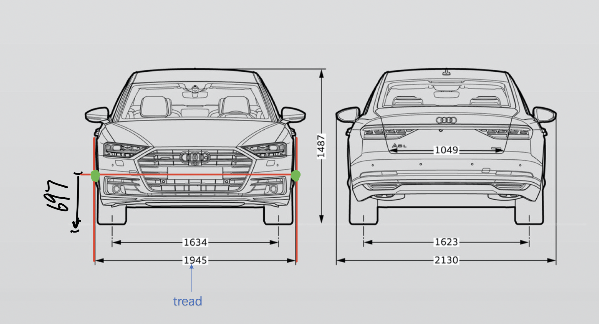

# TrackLineVisualization

## Requirements

+ python 3
  + yaml 
  + opencv
  + matplotlib

**Testing Environment(macOS)**

+ python 3.6
  + yaml 0.1.7
  + Opencv 3.4.2


## Usage

### Testing 

1. Enter the project folder
2. Open command line，and type in following command( just as an example):

```
python track_line_generator.py  --tread 1.832 --wheelbase 2.871 --front_wheel_to_head_d 0.89 --head_height 0.68 --camera_yaml_path your_yaml_file_path --video_path your_video_path
```

Or you could type in `python track_line_generator.py -h` for help:

```
usage: track_line_generator.py [-h] -t -w -f -e -c -v 

optional arguments:
  -h, --help            show this help message and exit
  -t, --tread       car width (meters)
  -w, --wheelbase   distance between the front and rear axles of a vehicle
  -f, --front_wheel_to_head_d 
                        distance between front wheel center and car head
  -e, --head_height 
                        z position of the point in the car head
  -c, --camera_yaml_path 
                        yaml file path for camera configuration
  -v, --video_path  video path
```

### Call from External File

```
from  track_line_generator.py import NewTrackLineGenerator

base_param = BaseParam(tread, wheelbase, head_height, front_wheel_to_head_d, param_yaml_path)
track_line_generator = NewTrackLineGenerator(base_param)
left_line,right_line = track_line_generator.add_track_line(steer_angle)
```


## Visualization Example

Sample results cannot be displayed due to data privacy.


## Deficiencies and Bugs

**Deficiencies**

1. trajectory equation

   + Curve left: $\left.x^{2}+(y+wheelbase * \cot (\phi)\right)^{2}=r_{L}^{2}$
     Curve Right: $x^{2}+(y+wheelbase * \cot (\phi))^{2}=r_{R}^{2}$

   + $r_{L}^{2} = \left(wheelbase * \cot (\phi)+\frac{tread}{2}\right)^{2}+(wheelbase + front\_wheel\_to\_head )^{2}$ 

     $r_{R}^{2} = \left(wheelbase * \cot (\phi)-\frac{tread}{2}\right)^{2}+(wheelbase + front\_wheel\_to\_head )^{2}$ 

   

2. transform matrix is estimated without considering distortion $\mathcal{D}$

   + $X_{w}, Y_{w}, Z_{w}$ is the  coordinates of track point in the real world (under vehicle coordinate system).
   + $u,v$ is the coordinates of pixel point  corresponding to $X_{w}, Y_{w}, Z_{w}$.

   

   + The reason for ignore  distortion $\mathcal{D}$ is that $\mathcal{D}$ cannot be represented by matrix multiplication ($\mathcal{D}$ is:

     

     $k_{1}, k_{2}, \rho_{1}, \rho_{2}, k_{3}$ are distortion parameters.

**Bugs**

1. The current change matrix is fixed. However, translation vector should be different with the one obtained afther calibration, and we doesn't know the plane's position when  calibration.

## Appendix



